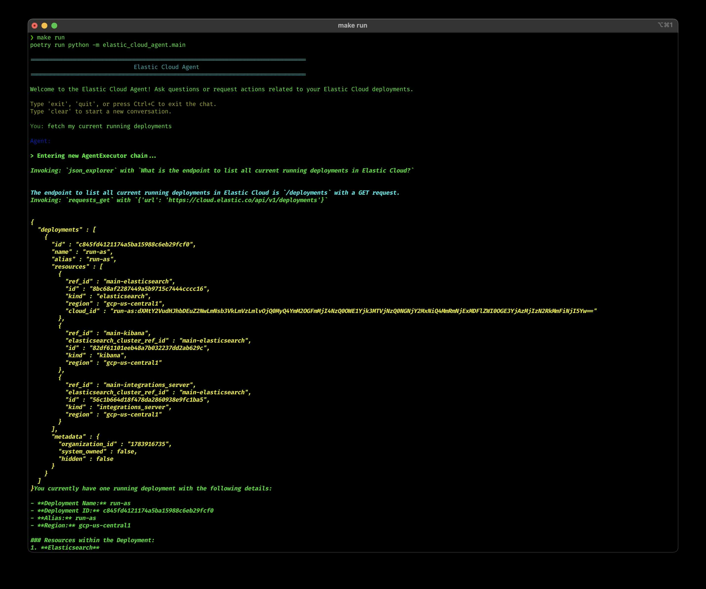

# Elastic Cloud Agent
[](https://github.com/lloydmeta/elastic-cloud-agent/actions/workflows/test.yml)

An interactive chat agent that allows administrators to talk to and ask questions about Elastic Cloud. The agent can search for information and perform actions by consuming an OpenAPI specification.



## Features

- Interactive chat interface for Elastic Cloud administration
- Uses LangChain and OpenAI for LLM capabilities
- Consumes Elastic Cloud API via OpenAPI specification
- Performs web searches to find relevant information
- Easy configuration via environment variables

## Prerequisites

- [Poetry](https://python-poetry.org/docs/#installing-with-the-official-installer) for dependency management
- OpenAI API key
- Elastic Cloud account and API key

## Installation

1. Clone the repository:

2. Install dependencies using Poetry:
   ```bash
   make install
   ```

3. Create a `.env` file by copying the example:
   ```bash
   cp .env.example .env
   ```

4. Edit the `.env` file and fill in your API keys and configuration.

5. Place your Elastic Cloud OpenAPI specification in `data/elastic_cloud_api.json`.

## Usage

Start the application:

```bash
make run
```

This will launch an interactive chat interface where you can ask questions about Elastic Cloud or request actions.

## Development

- Format code: `make format`
- Run linters: `make lint`
- Run tests: `make test`
- Clean up cache files: `make clean`